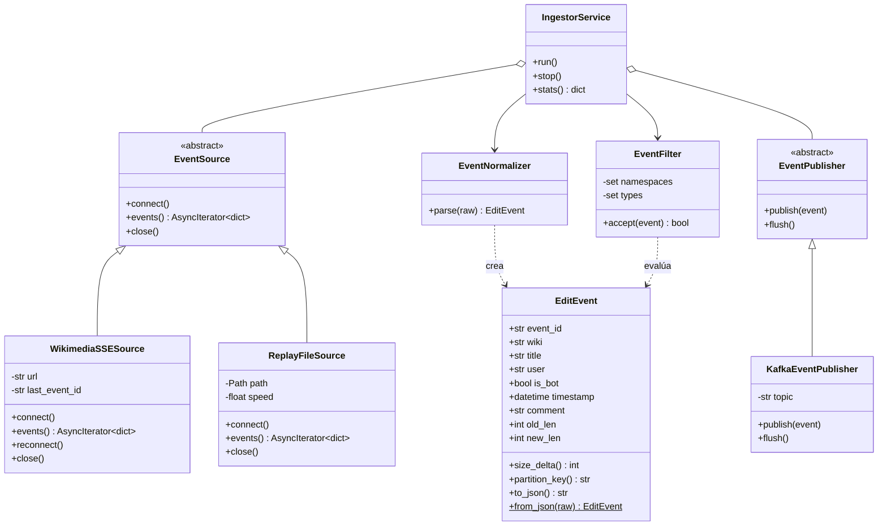
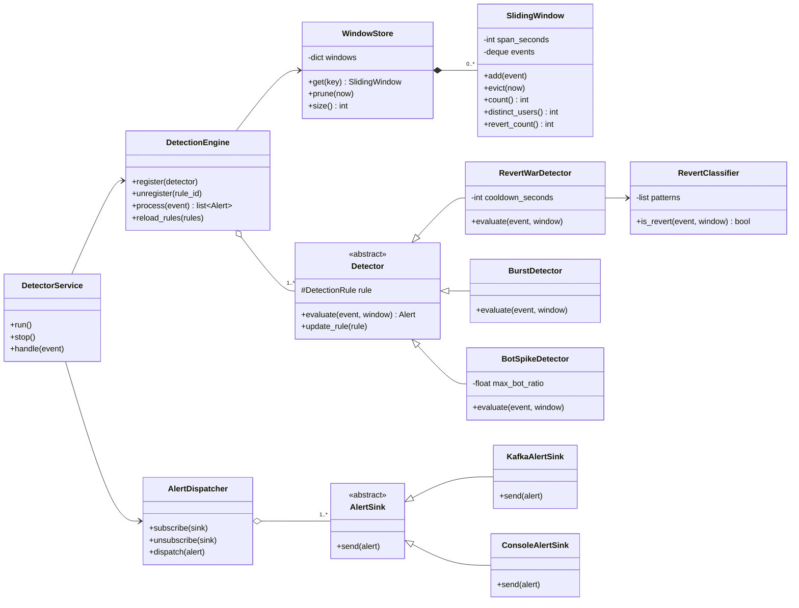
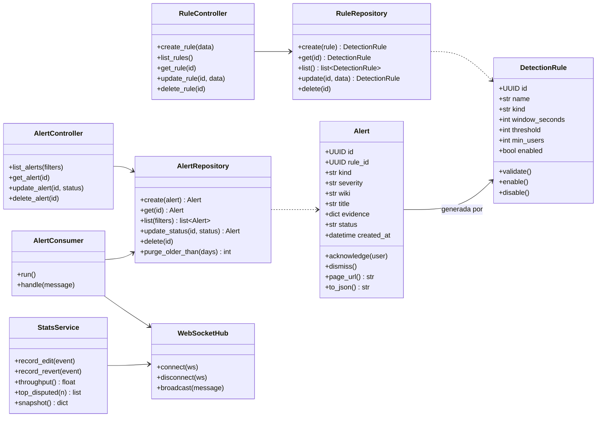
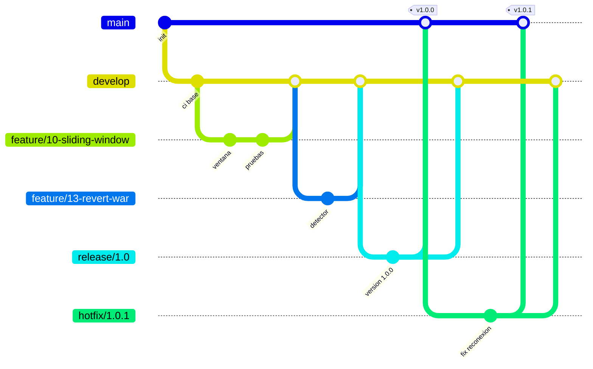

# EditWar Sentinel

**Detección en tiempo real de guerras de edición en Wikipedia sobre Kafka y Kubernetes**

Propuesta de proyecto final · Octubre de 2026

| | |
|---|---|
| **Alumnos** | Miguel Angel Moreno Martinez Emiliano Franco Gonzalez Francisco Jose Palacios Saad |
| **Materia** | Infraestructura para el Desarrollo Continuo (O2026_ESI3905O) |
| **Repositorio** | `github.com/m1ttt/editwar-sentinel` |
| **Docker Hub** | `hub.docker.com/u/<tu-usuario>` |

## 1. Descripción del proyecto

Wikipedia recibe decenas de ediciones por segundo. Una fracción de ellas son conflictos: dos o más editores que se revierten mutuamente el mismo artículo (una *guerra de edición*), ráfagas de vandalismo o picos de actividad automatizada. Hoy esos conflictos se descubren tarde, cuando alguien revisa el historial a mano.

**EditWar Sentinel** es una plataforma de procesamiento de flujos que consume en vivo el feed público de cambios de Wikimedia, detecta esos conflictos mientras ocurren y los muestra en un dashboard con alertas. No usa datos de prueba: cada evento que aparece en pantalla es una edición real que se puede abrir en Wikipedia en ese momento.

**Fuente de datos.** El stream `recentchange` de Wikimedia EventStreams (`https://stream.wikimedia.org/v2/stream/recentchange`), que se entrega por Server-Sent Events, es público y no requiere API key.

**Qué hace el sistema**

1. **Ingesta.** Se conecta al stream, normaliza cada evento y lo publica en Kafka.
2. **Detección.** Mantiene una ventana deslizante por artículo y evalúa reglas configurables: guerra de edición, ráfaga de ediciones y pico de bots.
3. **Alerta.** Publica cada hallazgo, lo guarda en PostgreSQL y lo empuja al dashboard por WebSocket.
4. **Administración.** Permite crear, consultar, modificar y eliminar reglas de detección, y consultar, reconocer y eliminar alertas.
5. **Resiliencia.** Corre en Kubernetes local: si un pod muere, el clúster lo repone y el consumo continúa desde el último offset confirmado, sin perder eventos.

**Demo de 30 segundos.** Dashboard con ediciones reales corriendo, se elimina el pod del detector con `kubectl delete pod`, Kubernetes lo levanta de nuevo y el flujo sigue sin huecos. El panel de alertas muestra las guerras de edición detectadas desde que se encendió el sistema.

**Alcance.** El proyecto corre completo en una sola máquina con k3d. No incluye despliegue en nube ni moderación automática: el sistema detecta y avisa, no edita Wikipedia.

## 2. Componentes y métodos

### 2.1 Componentes del sistema

| Componente | Tipo | Responsabilidad |
|---|---|---|
| **ingestor** | Servicio Python | Lee el stream SSE, normaliza, filtra y publica ediciones en Kafka. |
| **Kafka** | Broker de mensajes | Desacopla los servicios y conserva los eventos 24 h para reprocesarlos. |
| **detector** | Servicio Python | Mantiene ventanas por artículo, evalúa reglas y emite reversiones y alertas. |
| **api** | Servicio Python (FastAPI) | Persiste alertas, expone el CRUD de reglas y alertas, calcula métricas y transmite por WebSocket. |
| **dashboard** | Aplicación web (React) | Muestra el flujo en vivo, el ranking de artículos disputados, las alertas y la administración de reglas. |
| **PostgreSQL** | Base de datos | Guarda reglas de detección e historial de alertas. |

### 2.2 Entidades de dominio y operaciones (CRUD)

| Entidad | Crear | Leer | Actualizar | Eliminar |
|---|---|---|---|---|
| **Regla de detección** (`DetectionRule`) | `POST /api/rules` | `GET /api/rules` `GET /api/rules/{id}` | `PUT /api/rules/{id}` | `DELETE /api/rules/{id}` |
| **Alerta** (`Alert`) | Automática: la genera el detector y la guarda `AlertRepository.create()` | `GET /api/alerts` `GET /api/alerts/{id}` | `PATCH /api/alerts/{id}` (reconocer o descartar) | `DELETE /api/alerts/{id}` |
| **Edición** (`EditEvent`) | Automática: `KafkaEventPublisher.publish()` | `WS /ws/live` `GET /api/stats` | No aplica: es un hecho inmutable | Retención de Kafka (24 h) |

Además de los anteriores, la API expone `GET /healthz` para las probes de Kubernetes.

**Patrones de diseño aplicados.** *Strategy* en la jerarquía `Detector` (cada regla es un algoritmo intercambiable), *Observer* en `AlertDispatcher` y sus `AlertSink`, *Repository* para aislar PostgreSQL, y *Adapter* en `EventSource`, que permite cambiar el stream en vivo por un archivo grabado sin tocar el resto del código.

Los tres diagramas siguientes detallan las clases y los métodos de cada servicio.

### 2.3 Diagrama de clases: ingesta

### 2.4 Diagrama de clases: detección

### 2.5 Diagrama de clases: API, alertas y reglas

## 3. Stack tecnológico

| Capa | Tecnología | Uso en el proyecto |
|---|---|---|
| Lenguaje backend | Python 3.12 | Servicios ingestor, detector y api. |
| Cliente del stream | httpx + httpx-sse | Conexión SSE asíncrona con reconexión. |
| Mensajería | Apache Kafka en modo KRaft | Topics `wiki.edits`, `wiki.reverts` y `wiki.alerts`. |
| Cliente Kafka | aiokafka | Productores y consumidores asíncronos. |
| API | FastAPI + Uvicorn | REST, WebSocket y validación con Pydantic. |
| Persistencia | PostgreSQL + SQLAlchemy + Alembic | Reglas, alertas y migraciones versionadas. |
| Frontend | React + TypeScript + Vite | Dashboard en vivo, servido por nginx. |
| Pruebas | pytest, pytest-asyncio, pytest-cov | Pruebas unitarias y cobertura. |
| Calidad | ruff y mypy | Lint, formato y tipos estáticos. |
| Contenedores | Docker (multi-stage) y Docker Compose | Imágenes y entorno de desarrollo. |
| Orquestación | Kubernetes con k3d (k3s) | Clúster local de 1 servidor y 2 agentes. |
| Infraestructura como código | Kustomize + Makefile | Manifiestos declarativos y despliegue con un comando. |
| Autoescalado | KEDA | Escala el detector según el lag de Kafka. |
| CI/CD | GitHub Actions | Lint, pruebas, build y publicación de imágenes. |
| Registro de imágenes | Docker Hub | Cuatro imágenes públicas. |
| Gestión | GitHub Projects | Board, issues y milestones. |

## 4. Recursos e infraestructura

### 4.1 Recursos que se van a crear

| Recurso | Tipo en Kubernetes | Réplicas | Equivalente en Azure |
|---|---|---|---|
| Clúster `editwar` | k3d: 1 servidor, 2 agentes | — | Azure Kubernetes Service |
| ingestor | Deployment | 1 | Pod en AKS / Container Instances |
| detector | Deployment + ScaledObject | 1 a 5 | Pod en AKS con KEDA |
| api | Deployment + Service | 1 | Pod en AKS / Container Apps |
| dashboard | Deployment + Service | 1 | Static Web Apps |
| Kafka | StatefulSet + Service headless + PVC | 1 | Event Hubs (endpoint Kafka) |
| PostgreSQL | StatefulSet + Service + PVC | 1 | Azure Database for PostgreSQL |
| Ingress | Ingress (Traefik, incluido en k3s) | 1 | Application Gateway |
| Configuración | ConfigMaps | — | App Configuration |
| Credenciales | Secrets | — | Key Vault |
| Creación de topics | Job | — | — |
| Imágenes | 4 repositorios en Docker Hub | — | Container Registry |

**Topics de Kafka**

| Topic | Particiones | Clave | Productor | Consumidores |
|---|---|---|---|---|
| `wiki.edits` | 6 | `wiki:title` | ingestor | detector, api |
| `wiki.reverts` | 3 | `wiki:title` | detector | api |
| `wiki.alerts` | 1 | `alert_id` | detector | api |

La clave `wiki:title` garantiza que todas las ediciones de un artículo lleguen a la misma réplica del detector, que es lo que permite escalarlo sin partir las ventanas.

### 4.2 Diagrama de infraestructura

El proyecto corre en un clúster Kubernetes local (k3d). El diagrama usa la iconografía de Azure como notación; la columna *Equivalente en Azure* de la tabla 4.1 indica a qué servicio correspondería cada recurso si el sistema se migrara a la nube.

### 4.3 Diagrama de deployment

Todo el despliegue está automatizado: `make cluster` crea el clúster k3d, `make deploy` aplica los manifiestos con `kubectl apply -k` y `make destroy` lo elimina. Docker Compose queda como entorno de desarrollo y como respaldo para la demo.

### 4.4 Pruebas unitarias

Las pruebas corren en cada pull request y bloquean el merge si fallan. No usan red ni servicios reales: las dependencias externas se sustituyen por dobles en memoria, y los datos de entrada son eventos reales grabados del stream.

| Componente | Qué se prueba | Técnica |
|---|---|---|
| `EventNormalizer`, `EditEvent` | Parseo de eventos reales, campos faltantes, serialización | Fixtures JSONL grabados |
| `WikimediaSSESource` | Reconexión, backoff y `Last-Event-ID` | Servidor SSE falso |
| `EventFilter` | Casos aceptados y rechazados | Pruebas parametrizadas |
| `SlidingWindow`, `WindowStore` | Desalojo por tiempo, conteos, liberación de memoria | Reloj inyectado |
| `RevertClassifier` | Patrones por idioma y restauración de tamaño | Tabla de casos reales |
| Detectores | Umbral exacto, por debajo y por encima; cooldown | Ventanas sintéticas |
| `DetectionEngine` | Registro, recarga de reglas, aislamiento de errores | Detectores falsos |
| `AlertDispatcher` | Suscripción y entrega a todos los sinks | Sinks falsos |
| Repositorios | CRUD completo de alertas y reglas | Base de datos en memoria |
| Controladores de la API | Cada verbo, validación y errores | Cliente de pruebas de FastAPI |
| `StatsService`, `WebSocketHub` | Cálculo de métricas y difusión | Conexiones falsas |

**Criterio de aceptación:** cobertura mínima del 80 %, exigida por el pipeline.

### 4.5 Docker Hub

| Imagen | Contenido |
|---|---|
| `<tu-usuario>/editwar-ingestor` | Servicio de ingesta |
| `<tu-usuario>/editwar-detector` | Motor de detección |
| `<tu-usuario>/editwar-api` | API REST y WebSocket |
| `<tu-usuario>/editwar-dashboard` | Dashboard estático servido por nginx |

Las imágenes se construyen y publican desde GitHub Actions, nunca a mano.

| Evento en Git | Tags publicados |
|---|---|
| Merge a `develop` | `:edge` y `:sha-<commit>` |
| Merge a `main` | `:latest` |
| Tag `vX.Y.Z` | `:X.Y.Z` y `:X.Y` |

## 5. Estrategia de ramas

Se usa **GitFlow**. Aunque el trabajo sea individual, separa lo que está en desarrollo de lo que está listo para demostrarse y mapea directo a los tags de Docker Hub.

| Rama | Propósito | Nace de | Se fusiona en |
|---|---|---|---|
| `main` | Versiones estables y demostrables | — | — |
| `develop` | Integración continua del trabajo terminado | `main` | `release/*` |
| `feature/<issue>-<slug>` | Una issue del board | `develop` | `develop` |
| `release/<versión>` | Estabilización previa a una entrega | `develop` | `main` y `develop` |
| `hotfix/<versión>` | Corrección urgente sobre una versión publicada | `main` | `main` y `develop` |

**Reglas**

- `main` y `develop` están protegidas: solo se modifican por pull request con el pipeline en verde.
- Cada rama `feature` corresponde a una sola issue y su PR la cierra con `Closes #N`.
- Los commits siguen Conventional Commits (`feat:`, `fix:`, `test:`, `ci:`, `docs:`).
- Las `feature` se fusionan con squash; `release` y `hotfix` con merge commit para conservar el historial.

## 6. Plan de trabajo

### 6.1 GitHub Project Board

El board **EditWar Sentinel** se crea en GitHub Projects con vista de tablero y vista de tabla.

| Columna | Significado |
|---|---|
| Backlog | Issue definida, aún sin planear. |
| Ready | Tiene criterios de aceptación y entra en el sprint actual. |
| In progress | Tiene rama `feature` abierta. |
| In review | Tiene pull request abierto y el pipeline corriendo. |
| Done | PR fusionado en `develop` e issue cerrada. |

**Campos personalizados:** Sprint (milestone), Componente (etiqueta), Prioridad y Estimación en puntos.

**Definición de terminado:** código fusionado por PR, pruebas unitarias incluidas, pipeline en verde y criterios de aceptación cumplidos.

### 6.2 Sprints

| Sprint | Objetivo | Issues | Puntos |
|---|---|---|---|
| **Sprint 1 · Fundaciones e ingesta** | Repositorio, CI y eventos reales de Wikipedia fluyendo hacia Kafka. | #1&nbsp;a&nbsp;#9 | 22 |
| **Sprint 2 · Motor de detección** | Ventanas deslizantes, detectores y alertas publicadas en Kafka. | #10&nbsp;a&nbsp;#17 | 23 |
| **Sprint 3 · API y dashboard** | Persistencia, CRUD de reglas y alertas, y visualización en vivo. | #18&nbsp;a&nbsp;#26 | 24 |
| **Sprint 4 · Kubernetes y entrega** | Imágenes en Docker Hub, despliegue en k3d, autoescalado y demo. | #27&nbsp;a&nbsp;#35 | 23 |
| **Total** | | 35&nbsp;issues | 92 |

Las fechas de cada sprint se fijan en los milestones de GitHub según el calendario del curso.

### 6.3 Backlog

**Sprint 1 · Fundaciones e ingesta**

| # | Issue | Componente | Puntos |
|---|---|---|---|
| 1 | Inicializar monorepo y estructura de servicios | `infra` | 2 |
| 2 | Configurar GitFlow, ramas protegidas y plantillas | `infra` | 1 |
| 3 | CI: lint, tipos y pruebas unitarias en cada PR | `ci-cd` | 3 |
| 4 | Docker Compose de desarrollo con Kafka KRaft y PostgreSQL | `infra` | 3 |
| 5 | Modelo EditEvent y EventNormalizer | `ingestor` | 2 |
| 6 | WikimediaSSESource con reconexión y Last-Event-ID | `ingestor` | 5 |
| 7 | EventFilter por namespace y tipo de cambio | `ingestor` | 1 |
| 8 | KafkaEventPublisher particionado por artículo | `ingestor` | 3 |
| 9 | ReplayFileSource y grabación de fixtures reales | `ingestor` | 2 |

**Sprint 2 · Motor de detección**

| # | Issue | Componente | Puntos |
|---|---|---|---|
| 10 | SlidingWindow y WindowStore | `detector` | 3 |
| 11 | RevertClassifier heurístico | `detector` | 5 |
| 12 | Modelo DetectionRule y RuleRepository | `detector` | 3 |
| 13 | RevertWarDetector | `detector` | 3 |
| 14 | BurstDetector | `detector` | 2 |
| 15 | BotSpikeDetector | `detector` | 2 |
| 16 | DetectionEngine con recarga de reglas en caliente | `detector` | 3 |
| 17 | AlertDispatcher, KafkaAlertSink y ConsoleAlertSink | `detector` | 2 |

**Sprint 3 · API y dashboard**

| # | Issue | Componente | Puntos |
|---|---|---|---|
| 18 | Esquema PostgreSQL y migraciones con Alembic | `api` | 2 |
| 19 | AlertRepository y AlertConsumer | `api` | 3 |
| 20 | Endpoints REST de alertas | `api` | 3 |
| 21 | Endpoints REST CRUD de reglas | `api` | 3 |
| 22 | StatsService: throughput y artículos más disputados | `api` | 3 |
| 23 | WebSocketHub para eventos en vivo | `api` | 2 |
| 24 | Dashboard: flujo en vivo y throughput | `dashboard` | 3 |
| 25 | Dashboard: ranking de disputados y panel de alertas | `dashboard` | 3 |
| 26 | Dashboard: administración de reglas | `dashboard` | 2 |

**Sprint 4 · Kubernetes y entrega**

| # | Issue | Componente | Puntos |
|---|---|---|---|
| 27 | Dockerfiles multi-stage por servicio | `infra` | 2 |
| 28 | CD: build y push automático a Docker Hub | `ci-cd` | 3 |
| 29 | Clúster k3d declarativo y Makefile | `k8s` | 2 |
| 30 | Manifiestos Kustomize: Kafka StatefulSet y topics | `k8s` | 5 |
| 31 | Manifiestos Kustomize: servicios, probes y configuración | `k8s` | 3 |
| 32 | Autoescalado del detector con KEDA | `k8s` | 3 |
| 33 | Umbral de cobertura del 80 % en CI | `ci-cd` | 1 |
| 34 | Guion de demo y prueba de resiliencia | `docs` | 2 |
| 35 | Documentación final en Wiki y README | `docs` | 2 |

Cada issue se registra en GitHub con su descripción y sus criterios de aceptación. El script `crear_backlog.sh`, incluido con esta propuesta, crea las etiquetas, los milestones y las 35 issues en el repositorio y las agrega al board.

## 7. Riesgos y mitigaciones

| Riesgo | Mitigación |
|---|---|
| El stream no marca explícitamente las reversiones. | `RevertClassifier` las infiere por el comentario de la edición y por la restauración del tamaño del artículo, y se valida contra casos reales etiquetados. |
| Durante la demo puede no ocurrir una guerra de edición. | El sistema se enciende antes de presentar, de modo que el ranking y el historial ya contienen detecciones reales. La demo central es la recuperación del pod, que sí es repetible. |
| Falla de internet o del stream de Wikimedia. | `ReplayFileSource` reproduce eventos reales grabados con la misma interfaz. |
| Complejidad de Kafka en Kubernetes. | Un solo broker en modo KRaft sin operador, y Docker Compose como entorno alterno probado. |
